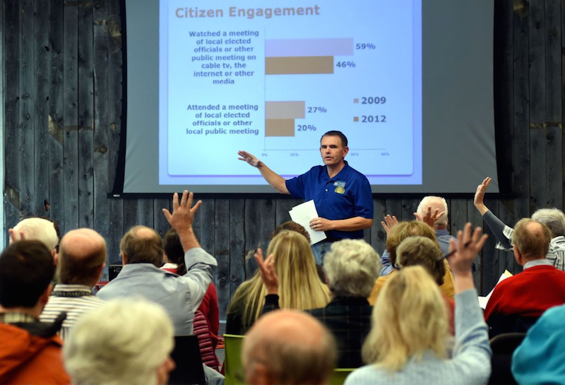
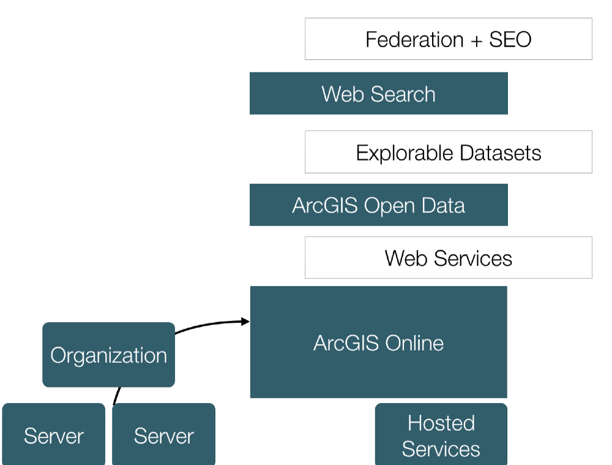
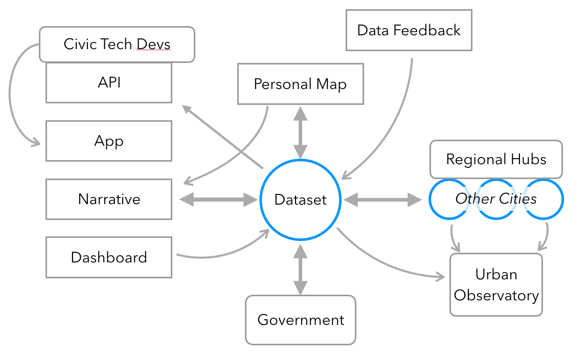
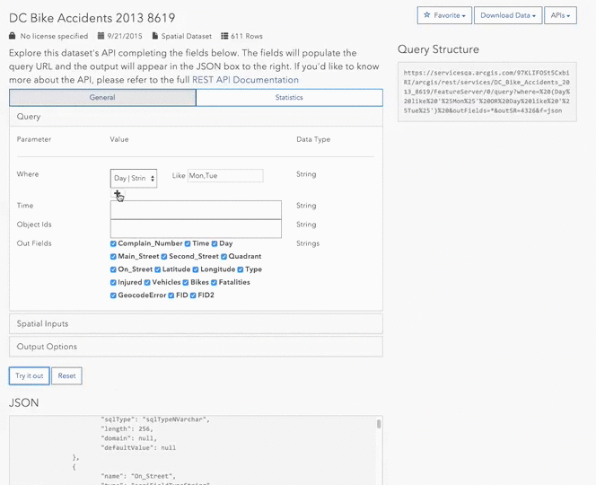

<!-- .slide: data-background="../reveal.js/img/title.png" -->

#ArcGIS Open Data
##for Developers

Andrew Turner, @ajturner
andrew@esri.com

---

# Agenda

http://ajturner.github.io/presentations/esri-devsummit-2016

- ArcGIS Open Data
- Architecture
- Customizing Sites
- Components
- API Explorer
- Road Ahead


---

# What is ArcGIS Open Data?

"Customizable site for organizations to provide data infrastructure to their public constituents."

- [Washington, DC](http://opendata.dc.gov)

---

## Data-Driven Citizenship



---



---

# Open Data capabilities

- Vector and Raster services
- Tabular data
- Smart Mapping, Charts, Table
- Full and Filtered Export as CSV, KML, Shapefile, GeoJSON
- Public user comment, favorites, custom views
- Faceted Search, Data recommendations
- Customized Style & Branding

---

# Customizing Sites

- [DHS HIFLD Open](https://hifld-dhs-gii.opendata.arcgis.com)
- [Iowa DOT](http://public.iowadot.opendata.arcgis.com/)
- [Delaware](http://opendata.firstmap.delaware.gov/)
- [Florida](http://geodata.dep.state.fl.us/)
- [Washington, DC](http://opendata.dc.gov)

- [Open Data Community](http://opendata.arcgis.com)

---

# API Explorer

- JSONAPI standard
- Hypermedia API
- [API Explorer](http://akharris.github.io/ember-arc-swag/#/api-explorer)
- [Open Data Search](https://github.com/esridc/opendata-search-component)

---

# Charts

- [Cedar](https://github.com/esri/cedar)
- [Cedar Dashboard](http://esri.github.io/cedar/examples/dashboard.html?map=a95e0bb28dc84a329a83650060922b23)

---

# Koop

- API Converter

- [KoopJS](https://koopjs.github.io)
- [Socrata->ArcGIS](http://geo.wa.gov/datasets/b0bb1490e2264892864e5254bf3ab6d8_0)

---

## Winnow

- [Winnow](https://github.com/dmfenton/winnow)

```js
const features = [...]
const options = {
  where: String // A sql where statement
  geometry: Object // GeoJSON or Esri geometry Object
  spatialPredicate: String // ST_Within || ST_Contains || ST_Intersects
  fields: Array // Set of fields to select from feature properties
  aggregates: Object // Describes the set of aggregations to perform on fields
}
winnow.query(features, options)
// Returns the set of features that match the query
```

---

# Federated + Embeddable Search

- [Open Data Search](https://github.com/esridc/opendata-search-component)
- [Charlotte Data.json](http://clt.charlotte.opendata.arcgis.com/data.json) + [Data.gov integration](http://catalog.data.gov/dataset?q=charlotte&sort=score+desc%2C+name+asc)

---

# Open Source

- [Open Data-Backbone](https://github.com/mjuniper/OpenData-Backbone)
- [Open Data-Ember](https://github.com/mjuniper/OpenData-ember)

---

# Road Ahead

---

# Hub



- (Los Angeles Hub)[http://geohub.lacity.org/]
- (Washington Cities Hub)[http://data1.awcnet.opendata.arcgis.com/]
- (Denton Texas Hub)[http://data.dentontxgis.opendata.arcgis.com/]

---

# Extensible and Modular

- Ember
- [UN SDG Dashboard](https://github.com/esri/sdg-dash)

---

## GeoServices Explorer



- [GeoServices RAML](http://geoservices.github.io/geoservices-raml/)

---

## Calcite shared branding

- [Calcite-Bootrap](http://)
- [Integrated Solutions](http://arcgis.github.io/multilayer-report/mockOrgOpenDataSite.html)

---

## Additional Resources

http://ajturner.github.io/presentations/esri-devsummit-2016

- [Slack: #GISDevs](https://gisdevs.slack.com/)
- [GeoNet: Open Data](https://geonet.esri.com/community/gis/web-gis/arcgis-open-data)
- andrew@esri.com
- @ajturner 

### Fill out your survey

---

<!-- .slide: data-background="../reveal.js/img/end.png" -->